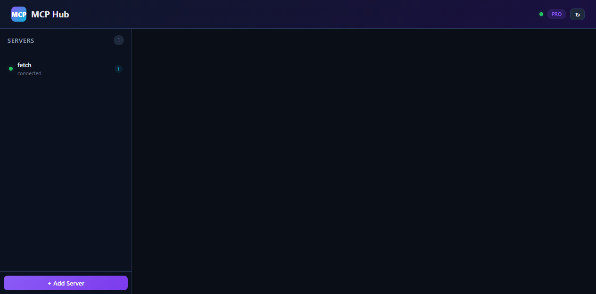

# MCP Hub

> The Control Panel for Your AI Tools

A visual dashboard to add, connect, and call MCP (Model Context Protocol) servers — your AI agents' tools, all in one place. No config files. No terminal.

**[🌐 Live Demo](https://moreee326.github.io/MCP-Hub/)** · **[☕ Support on Ko-fi](https://ko-fi.com/moreee326)**



## Quick Start

```bash
git clone https://github.com/Moreee326/MCP-Hub.git
cd mcp-hub
npm install
node server.js
# Open http://localhost:3456
```

## Features

| | |
|---|---|
| 🖥️ **Visual Dashboard** | See all MCP servers with color-coded status indicators |
| 🔌 **One-Click Connect** | Connect to any MCP server, auto-discover tools instantly |
| 🧰 **Inline Tool Calling** | Call any MCP tool with JSON arguments. See results in real-time |
| 🗂️ **MCP Server Marketplace** | Browse 10+ popular MCP servers and add them with one click |
| 📋 **Tool Call History** | Record of every tool call with params and results |
| 📡 **Log Viewer** | Real-time stderr viewer for each connected server |
| 💾 **Persistent Config** | Server configurations survive restarts |
| 📤 **Export / Import** | Download and upload server configs as JSON |
| 🔍 **One-Click Update** | Auto-check for new versions on startup |

## Pricing

**MCP Hub is free for everyone.** No limits, no trials.

If you find it useful, consider [buying me a coffee ☕](https://ko-fi.com/moreee326). Supporters get a 💜 badge in the dashboard — but all features are unlocked regardless.

## Requirements

- **Node.js 18+** (download from [nodejs.org](https://nodejs.org))
- macOS, Linux, or Windows

## What is MCP?

Model Context Protocol (MCP) is an open standard created by Anthropic that gives AI agents access to tools — filesystem, GitHub, databases, APIs, and more. MCP Hub gives you a beautiful UI to manage them all.

## Project Structure

```
mcp-hub/
├── server.js          # Backend API server (port 3456)
├── index.html         # Landing / marketing page
├── dashboard.html     # Dashboard SPA (at /app)
├── bin/mcp-hub.js     # CLI entry point
├── install.sh         # One-click install script
├── package.json
└── README.md
```

## License

MIT
